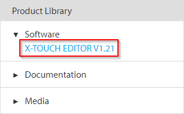
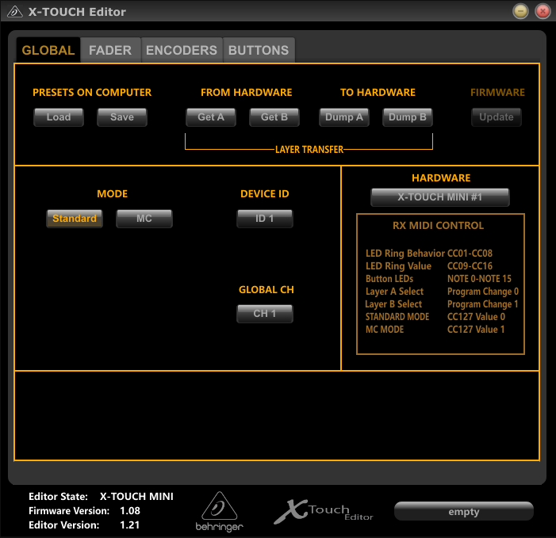
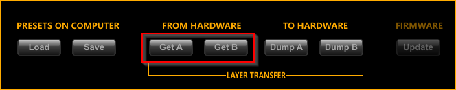
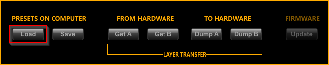
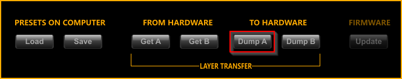

# Behringer X-Touch Mini

I own a Behringer X-Touch Mini and all examples are actually made for this wonderful little device. In order to use it
with my examples, it is required to use the same settings as me. I included my settings in the folder 
**templates/Behringer X-Touch Mini**.

## How to apply those settings?

1. Download the X-Touch Editor software from the Behringer [webpage](https://www.behringer.com/product.html?modelCode=P0B3M)

   

2. Unzip the file and start the **X-TOUCH.exe** program

   

3. You can adjust the type of MIDI message to be sent for each encoder, button and the slider. You can load the current
settings from the device by clicking the buttons **Get A** or **Get B**. A and B represent the two layers you can choose
from.

   

4. To apply my settings, select the **Load** button and choose **LayerA.bin** from the templates folder.

   

5. After loading the settings you have to apply them to the device by clicking the **Dump A** button.

   

6. Repeat the same procedure with **LayerB.bin** and dump it to layer B.

    
