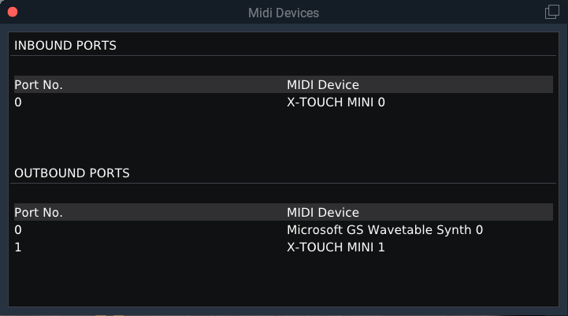

# Create a new aircraft profile

The easiest way to create a new aircraft profile, would be to create a copy of the included template for the 
Behringer X-Touch Mini. Simply copy the `XMidiCtrl.toml` file from the `templates` directory of the XMidiCtrl 
installation and place it into the aircraft directory of the aircraft you want to create it for.

You can also store your profiles outside the aircraft directory, if you prefer so. Please have a look at 
[Aircraft Profiles](profile.md) for more detailed information about all the different options.

## Name and Version

The first two lines of a profile are title and version. They don't really have any function and are purely for your
information.

**Example:***
```
title   = "My configuration for the Cessna 172"
version = "1.00"
``` 

## Inbound and Outbound Ports for MIDI Devices

It is required to set the inbound and outbound ports for each MIDI device. In order to determine the ports for your MIDI 
devices, you can use the function **Show MIDI Devices** within XMidiCtrl. Simply go to 
`Plugins -> XMidiCtrl -> Show MIDI Devices` and you will get a list of all connected MIDI devices.



The ports have to be defined for each device:

**Example:**
```
# Behringer X-Touch Mini
[[device]]
name     = "Behringer X-Touch Mini"
port_in  = 0
port_out = 1

# Loupedeck Live
[[device]]
name     = "Loupedeck Live"
port_in  = 1
```

> You don't have to define an outbound port if your MIDI device does not support inbound MIDI messages to illuminate 
> buttons.

Further information about MIDI Devices can be found [here](device.md).

## Mappings

Next would be the definition of some mappings. You can create inbound mappings and outbound mappings. Inbound mappings
are MIDI messages, which are sent from the MIDI device to X-Plane. This would happen once a button gets pressed on your
device. Outbound mappings allow you to control the lights on your MIDI device, such as highlight a button if the 
autopilot is activated.

You don't have to define an outbound mapping. I would actually recommend to start with the inbound mapping first. Once
you are happy with it, you can add the outbound mapping.

> Each mapping has to be a separate line. Please note that line breaks are not supported by TOML.

**Example for some inbound mappings:**
```
# Behringer X-Touch Mini
[[device]]
name       = "Behringer X-Touch Mini"
port_in    = 0
port_out   = 1
mapping_in = [
  { ch = 11, cc = 10, type = "cmd", command = "laminar/B738/LDU_control/push_button/MFD_ENG" },
  { ch = 11, cc = 11, type = "cmd", command = "laminar/B738/LDU_control/push_button/MFD_SYS" },
  { ch = 11, cc = 12, type = "cmd", command = "laminar/B738/LDU_control/push_button/MFD_CR" }
]
```

**Example including outbound mappings:**
```
# Behringer X-Touch Mini
[[device]]
name        = "Behringer X-Touch Mini"
port_in     = 0
port_out    = 1
mapping_in  = [
  { ch = 11, cc = 19, type = "cmd", command = "laminar/B738/autopilot/speed_press" },
  { ch = 11, cc = 20, type = "cmd", command = "laminar/B738/autopilot/vnav_press" },
  { ch = 11, cc = 21, type = "cmd", command = "laminar/B738/autopilot/lnav_press" }
]
mapping_out = [
  { ch = 11, cc = 19, type = "drf", dataref = "laminar/B738/autopilot/speed_pos", value_on = "1", value_off = "0" },
  { ch = 11, cc = 20, type = "drf", dataref = "laminar/B738/autopilot/vnav_pos",  value_on = "1", value_off = "0" },
  { ch = 11, cc = 21, type = "drf", dataref = "laminar/B738/autopilot/lnav_pos",  value_on = "1", value_off = "0" }
]
```
