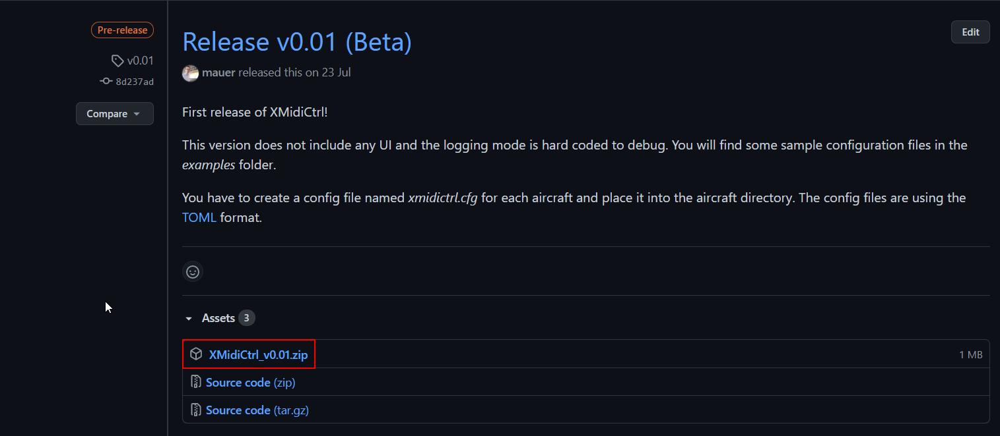

# Installation

XMidiCtrl is an X-Plane plugin and has to be installed in the plugin's directory of your X-Plane installation:

1. Download the latest release from the [XMidiCtrl GitHub](https://github.com/mauer/xmidictrl/releases) webpage. Please download the binary package and not the source code:
   
2. Extract the downloaded zip file to some temporary directory, like your desktop
3. Move the folder **XMidiCtrl** into your **../X-Plane/Resources/plugins** directory

The installation of XMidiCtrl includes several directories:

```
XMidiCtrl
|- win_x64       --> plugin binary for Microsoft Windows
|- examples      --> example configurations for various aircraft
|- templates     --> template configurations for MIDI devices
|- profiles      --> active configurations
```

You can place the configuration file for an aircraft directly in the aircraft directory of the in profiles directory of the plugin.